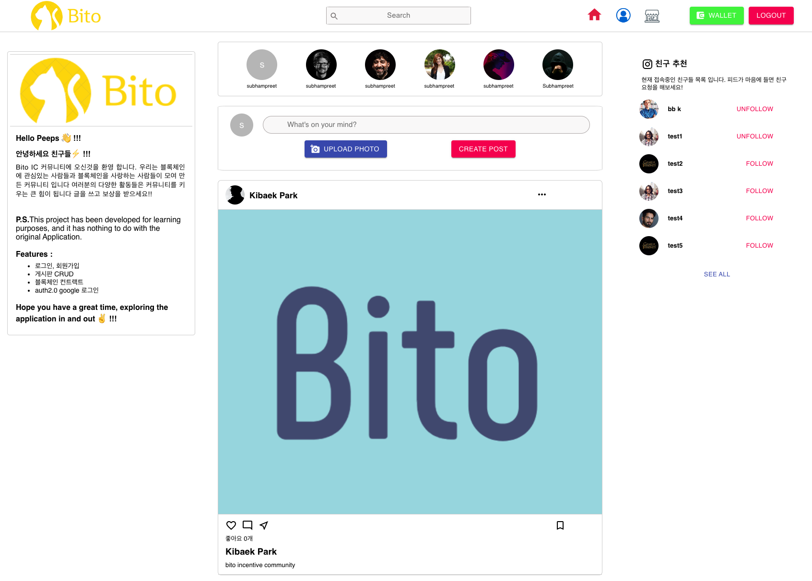
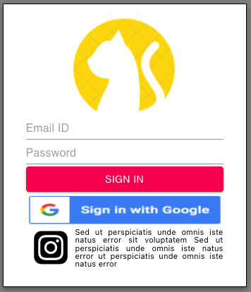

# beb-05-Bito
beb-05-Bito
 
 
 npm install 명령어를 통해 모듈을 설치한다. (/server, /client path에서)

    
    npm install
    

 프로젝트를 실행한다.

    
    npm start
    

## 페이지

1. Home: 글을 쓰고, 포스팅을 할 수 있으며 follow 작업을 할 수 있다.

    

2. Login: google OAuth 이용한 로그인.

    

<!-- 3. TokenDetail: NFT 작품의 상세 정보를 확인하고 거래를 할 수 있다.

    

4. Create: 이미지를 NFT로 민팅할 수 있다.

    

5. Profile: 현재 계정의 정보와 소유한 NFT 작품을 확인할 수 있다.

     -->

## 기술 스택

- 프론트엔드: React, node.js, SCSS
- 블록체인: Etehreum(Rosten Testnet), Ganache
- 기타: web3.js, NFT Storage, MetaMask

.env_example 파일을 .env로 바꾸고에 아래를 채웁니다.

   GOOGLE_CLIENT_ID
   
   GOOGLE_CLIENT_SECRET
   
   DATA_BASE_URL
   
   DATA_BASE_NAME

## 팀원

박기백 [@parkkibaek](https://github.com/parkkibaek)

김병일 [@DevUreak](https://github.com/DevUreak)

서경근 [@Sapphire52000](https://github.com/Sapphire52000)

허윤석 [@ysheokorea](https://github.com/ysheokorea)
