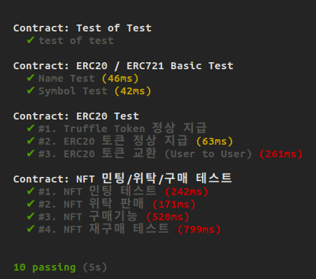

# Contract 기능

## 구성

- ERC20Token Contract : ERC20 토큰 발행
- ERC721Token Contract : ERC721 토큰 발행
- Marketplace Contract : Marketplace 관리

<br><br>

## 사용법
- Marketplace 컨트랙트 ABI와 Address 필요
- 컨트랙트 객체 생성
```
const contract = new web3.eth.Contract(abi, contractAddr);
const result = await contract.methods.FUNCTION().call(); // call 함수(Tx 발생 안함)
const result = await contract.methods.FUNCTION().send(); // Tx 발생
```

### 1. 사용자들은 최초 ERC20 토큰을 지급받아야 함(`ERC20_Provider` 함수 사용)
### 2. `글쓰기` / `댓글` / `좋아요` 등 행동에 따라 ERC20 토큰 추가 지급가능(401 코드는 최초 한번만 가능)
### 3. NFT 민팅시 (`createERC721Token` 함수 사용)
### 4. NFT 민팅 후 Contract로 NFT 판매 위탁 트랜잭션을 보내야 함(`setAllNFTsToContract` 함수 사용)
> **NFT 민팅 후 곧 바로 판매 불가**

<br><br>

## Marketplace Functions

1. **ERC20_Provider(`int _benefit`) return(`bool`)**
    - 사용자가 게시글을 발행한 경우 보상으로 토큰 지급
    - 사용자가 댓글을 다는 경우 보상으로 토큰 지급

<center>

|코드|Action|보상|
|:---:|:---:|:---:|
|101|포스팅|10 Token|
|201|댓글|3 Token|
|301|좋아요|1 Token|
|401|최초지급|100 Token|

</center>


2. **ERC20_Transfer_User2User(`address _to`, `uint256 _amount`) return(`bool`)**
    - 사용자들은 서로 ERC20 토큰을 주고 받을 수 있다.

3. **createERC721Token(`string memory _tokenURI`, `int _price`) return(`bool`)**
    - 사용자는 본인이 가진 ERC20 토큰을 사용해 NFT를 발행할 수 있다.
    - ERC721URIStorage 사용하여 tokenURI를 설정한다.
    - Marketplace 컨트랙트는 `spender` 역할을 수행한다.

4. **buyERC721Token(`int _itemId`)**
    - 사용자는 본인이 가진 ERC20 토큰을 사용해 NFT를 구매할 수 있다.
    - NFT 구매시 `fee`를 포함한 가격을 지불해야 한다.

5. **setAllNFTsToContract()**
    - 등록한 NFT를 마켓플레이스에 위임하는 기능
    - 현재 소유한 모든 NFT의 양도권을 마켓플레이스에 위임함.

6. **getBalanceOfERC20(`address _address`) return(`uint256`)**
    - 해당 계정의 ERC20 잔액을 반환합니다.

7. **getOwnerOfERC721(`uint256 _tokenId`) return(`address`)**
    - NFT의 소유자를 반환합니다.

8. **getIsApprovedForAll(`address _owner`, `address _operator`) return(`bool`)**
    - owner가 spender에게 NFT 판매권을 양도했는지 여부를 반환합니다.

9. **getTokenURIERC721(`int itemId`) return(`string`)**
    - 해당 item의 tokenURI를 반환합니다.

10. **itemCount() return(`uint256`)**
    - 발행된 전체 NFT의 갯수를 반환한다.

11. **setERC20Token(`address _contractAddress`) return(`bool`)**
    - 배포된 ERC20 토큰 주소로 설정
    - 기본 설정되어있으므로, 추가로 설정할 필요는 없음.

12. **setERC721Token(`address _contractAddress`) return(`bool`)**
    - 배포된 ERC721 토큰 주소로 설정
    - 기본 설정되어있으므로, 추가로 설정할 필요는 없음.

13. **token20Name() / token721Name() return(`string`)**
    - 컨트랙트에 설정된 이름 반환

14. **token20Symbol() / token721Symbol() return(`string`)**
    - 컨트랙트 symbol 반환

15. **getItemSeller(`int _itemId`)**
    - 현재 해당 itemId의 Seller를 반환함.

<br><br>

## Test Case

<center>

  

</center>

[완료] ERC20/ERC721 컨트랙트 정상 작동 확인
    - name 확인

[완료] 사용자가 최초 ERC20 토큰을 지급받는 경우
    - 사용자의 밸런스는 0이어야 함(최초 1번만 지급)
    - 사용자의 주소는 0x0이 아니어야 함    

[완료] 사용자가 NFT를 발행할수 있어야 함
    - itemCount가 증가해야 함
    - 새로 발행된 NFT의 소유는 발행자에게 귀속됨.

[완료] 사용자가 NFT를 구매하는 경우
    - 가격과 수수료를 포함한 토큰이 전송됨
    - 가격은 seller에게, 수수료는 컨트랙트 계정으로 전송됨
    - 구매자의 토큰 balance는 가격+수수료만큼 줄어듬

